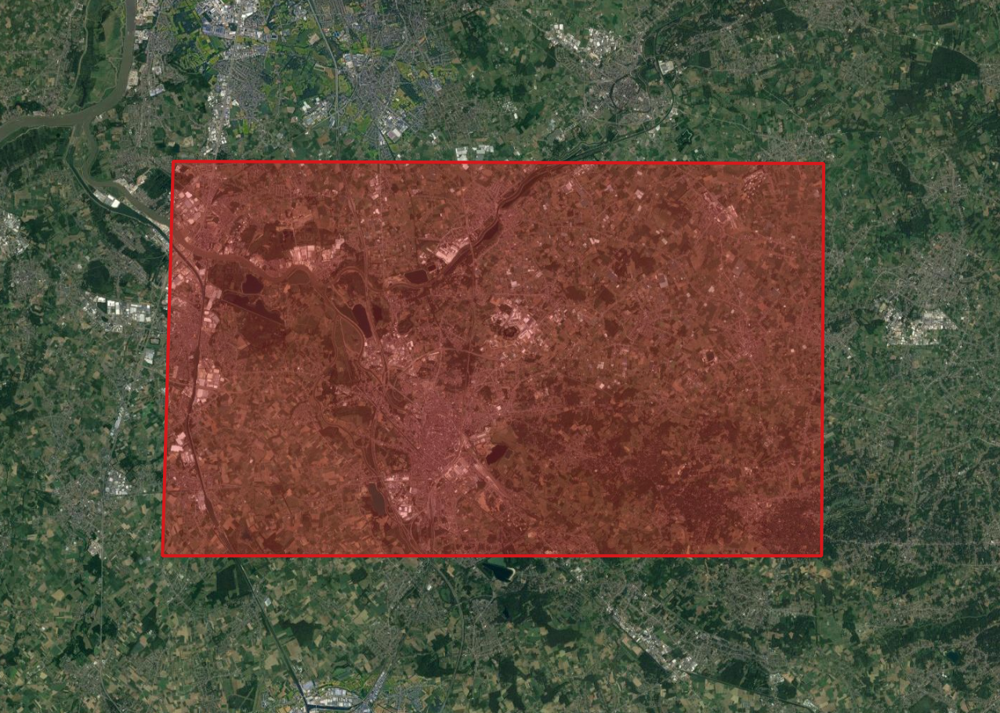
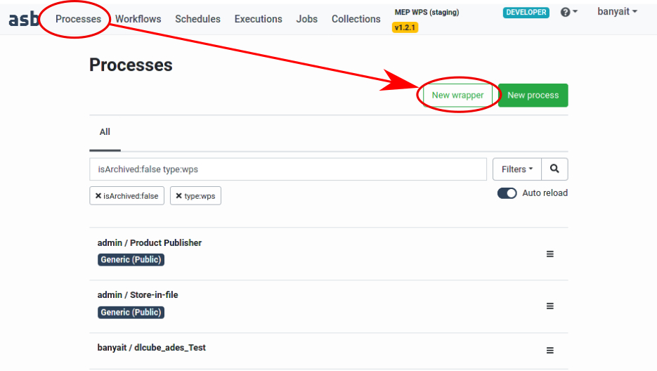
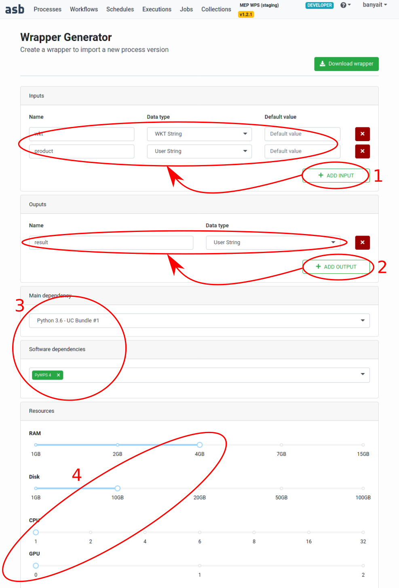
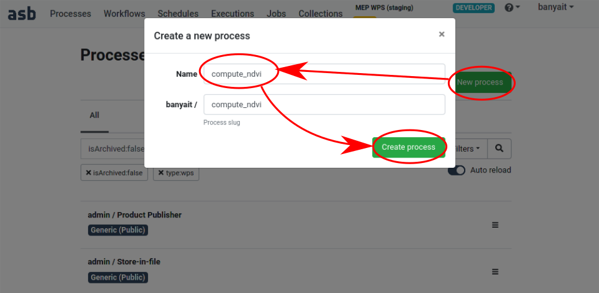
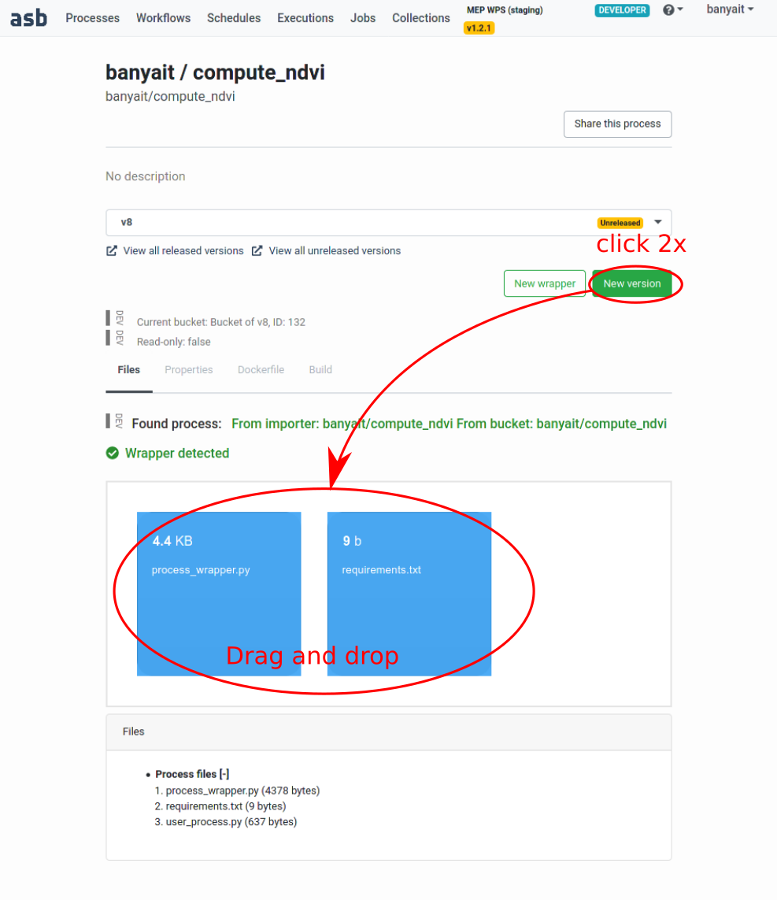
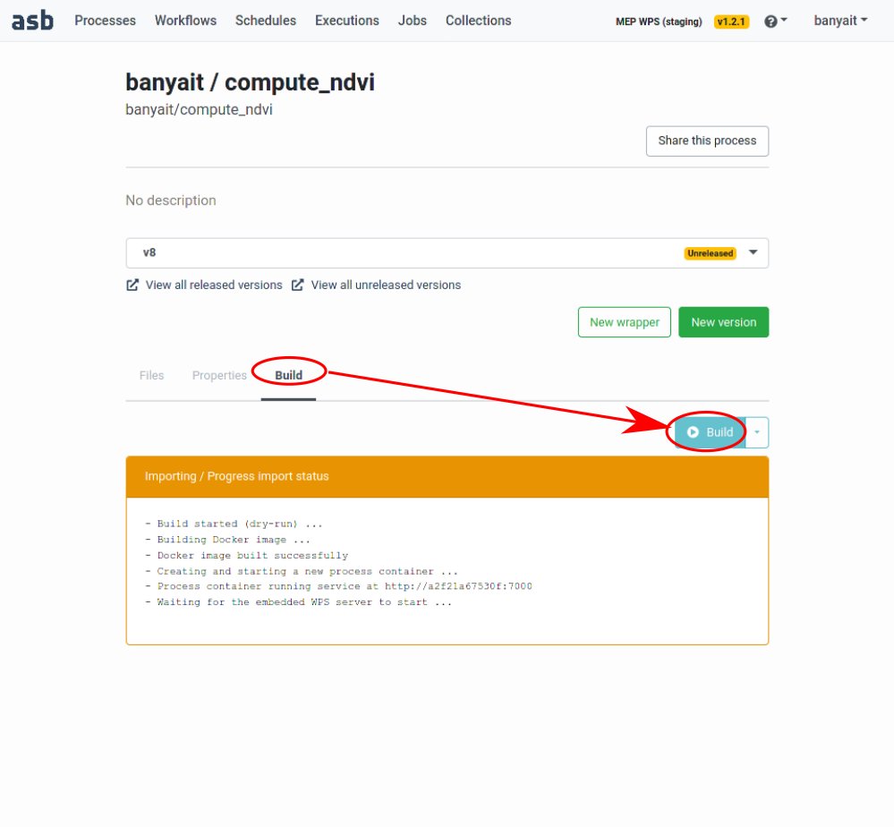
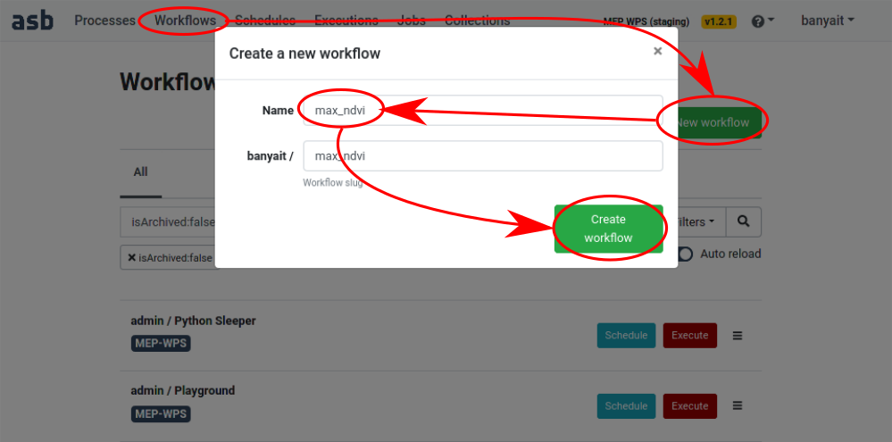
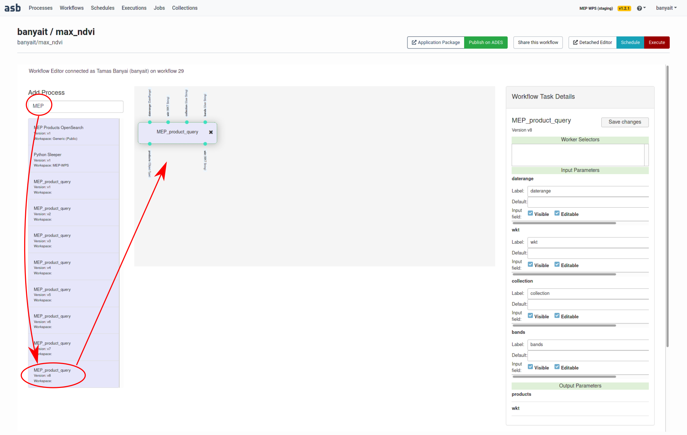
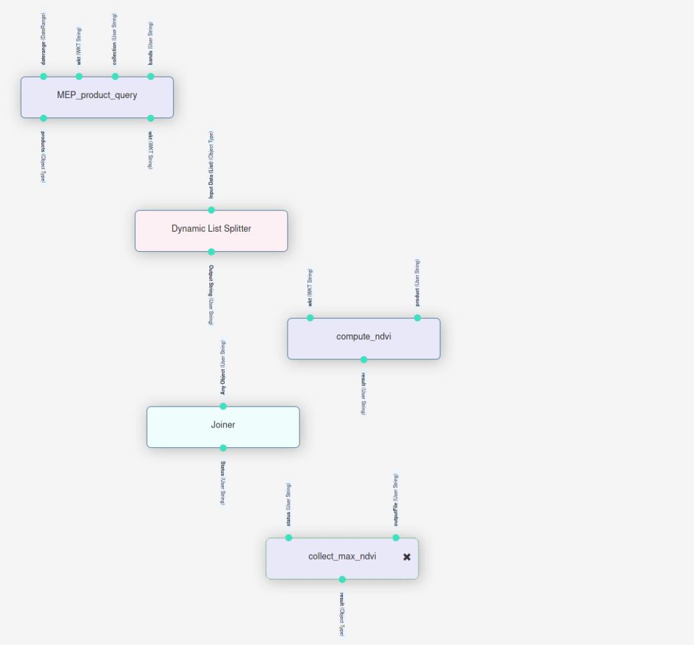

# ASB developer codes user manual

## Getting Started Tutorial

This tutorial will walk through the creation and execution of a simple workflow in the Automated Service Builder (ASB), which can serve as a starting template for future workflows.

### Introduction

The ASB interface is built around the concept of creating processes and workflows. 
A process can be viewed as a sort of "unit of work", a building block that has inputs/outputs and does an elementary part of the work.
Each process runs it's own docker container.
By connecting the appropriate outputs to inputs between a set of processes, one can create workflows.
A workflow can then be executed on the uderlying cluster.

In this example the maximum normalized difference vegetation index (NDVI) will be calculated. 
The formula for NDVI is (B8-B4)/(B8+B4), where the input bands B4 is the red and B8 of the near-infrared part of the reflectance spectrum. 
The inputs will be taken from the Sentinel L2A observations and NDVI needs to be computed at every pixel in the area of interest. 
Finally the max NDVI image is obtained by taking the maximum over a given time period.   

### Pre-requisites

You have read the following parts of the documentation:

* nomenclature: [https://mep-wps.vgt.vito.be/docs/user/index.html#definitions-and-acronyms](https://mep-wps.vgt.vito.be/docs/user/index.html#definitions-and-acronyms)
* how to manage processes: [https://mep-wps.vgt.vito.be/docs/user/index.html#processes-management](https://mep-wps.vgt.vito.be/docs/user/index.html#processes-management)
* how to manage workflows: [https://mep-wps.vgt.vito.be/docs/user/index.html#workflows-management](https://mep-wps.vgt.vito.be/docs/user/index.html#workflows-management)

And at least basic knowledge of Python language, since the codes used in this tutorial are written in Python.
 
### What are we going to do

The straightforward approach is to first query the sources, then compute NDVI in a distributed fashion and finally combine the parts together using maximum function. 
Within the ASB interface this requires five processes:

1. Product query: obtains the list of the corresponding B4 and B8 image pairs
1. Dynamic splitter: parallelizes the work based on the query results and launches the NDVI calculators
1. NDVI calculator: computes NDVI over an image pair
1. Joiner: waits for all NDVI calculators to finish
1. Collect_and_max: combines the outputs of the NDVI calculators 

### Creating/reusing the processes

Login to the portal: [https://mep-wps.vgt.vito.be](https://mep-wps.vgt.vito.be)

The advantage of the process/workflow system is the reusability of the processes in many different workflows. In fact 3 out of the 5 processes are readily available. 
The product_query, dynamic list splitter and the oin processes will be reused.

#### Product query

As mentioned, one does not have to implement the search, rather reuse the query_product process developed by VITO.
It can be used to search in the Terrascope database [terrascope.be](terrascope.be) provided by VITO.
Given the area of interest in WKT string, the date range, collection id and band names it returns a list of file names (where they are in the file system).
These are the individual images that overlap with the area of interest within the date range.

 
<ins>

Due to the current limitation on the length of the strings in the list (imposed by the splitter), the strings are encoded as follows:

    /path/to/data/S2B_20180605T105029_31UFS_TOC-B0+4_10M_V200.tif+8_10M_V200.tif

This string has to be split at '+' characters and the first entry is the common prefix of the rest of the array.
In this case this represents a list of two files:

    /path/to/data/S2B_20180605T105029_31UFS_TOC-B04_10M_V200.tif
    /path/to/data/S2B_20180605T105029_31UFS_TOC-B08_10M_V200.tif

</ins>
 

We will use the following inputs:

* collection: urn:eop:VITO:TERRASCOPE_S2_TOC_V2  (Sentinel2 L2A images mirrored by Terrascope)
* date range: {"start":"2018-06-25T00:00:00", "end":"2018-06-30T00:00:00"} (JSON string covering just a few days)
* WKT: POLYGON((4.665785 51.110600, 4.350147 51.111254, 4.344939 50.990762, 4.664744 50.990762, 4.665785 51.110600)) (small area around the Belgian city called Mechelen)
* bands: ["B04","B08"] (red and NIR bands as alread mentioned before)

 <em>Figure: Area of interest</em>

#### Dynamic list splitter

This is also a builtin process that takes an array of strings as json. It splits up the array and indepenently launches the next process in the chain. 
Note that the splitter is a smart process in terms of resource management. 
For example if 10 cpus available and each process is using 2, but the split yields to 50 processes: the splitter ensures that 5 processes willbe running concurrently.

#### Compute NDVI

This process has to be developed since it contains our 'business logic'. 
Let's implement it in the following fashion:
* load B4 and B8 into xarrays
* using the area of interest WKT, restrict the calculation to the bounding box
* compute NDIV
* save to temporary file

The main source code of any process is called process_wrapper.py, this is a Python script with a special layout that is parsed and understood by the system. 

##### Creating the process wrapper

ASB provides a convenient way to generate a template interface, go to Processes -> New wrapper:

 <em>Figure: wrapper creation</em>

Then setup the inputs (1), outputs (2), select the dependencies (3) and resources (4) as shown:

 <em>Figure: wrapper setup</em>

Click on download and save the file at a suitable location. 
This produces an empty wrapper to start with.
Because we are going to save the results in NetCDF format, we will need an extra dependency that is not in the PyWPS4 group. 
Next to the wrapper, save a file called requirements.txt. This file should have a single line: h5netcdf.

Open the file in your favorite editor and copy paste the following code:

    #!/usr/bin/python
    
    import logging
    import shapely.wkt
    import pyproj
    import xarray
    from shapely.ops import transform
    import uuid
    from pathlib import Path
    import numpy
    
    # --------------------------------------------------------------------------------------
    # Save this code in file "process_wrapper.py" and adapt as indicated in inline comments.
    #
    # Notes:
    #  - This is a Python 3 script.
    #  - The inputs will be given values by name, thus their order has no importance ...
    #  - ... except that the inputs with a default value must be listed last.
    #  - Parameter names are automatically converted into valid Python variable names.
    #  - Any empty line or line starting with a '#' character will be ignored.
    # --------------------------------------------------------------------------------------
    
    
    logger = logging.getLogger(__name__)
    logging.basicConfig(level=logging.INFO)
    
    def execute(out_dir, wkt, product):
        """
        Inputs:
        wkt -- wkt -- 92/WKT String
        product -- product -- 45/User String
    
        Outputs:
        result -- result -- 45/User String
    
        Main Dependency:
        mep-wps/uc-bundle-1
    
        Software Dependencies:
        pywps-4
    
        Processing Resources:
        ram -- 4
        disk -- 10
        cpu -- 1
        gpu -- 0
        """
    
        # ----------------------------------------------------------------------------------
        # Insert your own code below.
        # The files generated by your code must be stored in the "out_dir" folder.
        # Only the content of that folder is persisted in the datastore.
        # Give appropriate values to the output parameters. These will be passed to the next
        # process(es) following the workflow connections.
        # ----------------------------------------------------------------------------------
    
        logger.info("Starting...")
    
        # extract file names of the required bands
        pl=product.split("+")
        prodB4=pl[0]+[i for i in pl[1:] if "B04" in pl[0]+i][0]
        prodB8=pl[0]+[i for i in pl[1:] if "B08" in pl[0]+i][0]
        logger.info("Band B04: "+prodB4)
        logger.info("Band B08: "+prodB8)
            
        # open the files
        B4i=xarray.open_rasterio(prodB4)
        B8i=xarray.open_rasterio(prodB8)
        
        # convert area of interest into the desired coordinate system
        geom=shapely.wkt.loads(wkt)
        wgs84 = pyproj.CRS('EPSG:4326')
        gproj = pyproj.Transformer.from_crs(wgs84, B4i.crs, always_xy=True).transform
        geom = transform(gproj, geom)
        #geom=shapely.affinity.translate(geom, 120000.)
        bbox=geom.bounds
        
        # select part inside bbox
        B4=B4i.where((B4i.x>=bbox[0]) & (B4i.x<=bbox[2]) & (B4i.y>=bbox[1]) & (B4i.y<=bbox[3]),drop=True)
        B8=B8i.where((B8i.x>=bbox[0]) & (B8i.x<=bbox[2]) & (B8i.y>=bbox[1]) & (B8i.y<=bbox[3]),drop=True)
    
        # convert to floating point
        B4=B4.astype(numpy.float64)
        B8=B8.astype(numpy.float64)
        for indv in B4i.attrs.get('nodatavals',[]):
            B4=B4.where(B4!=indv, drop=True)
        for indv in B8i.attrs.get('nodatavals',[]):
            B8=B8.where(B8!=indv, drop=True)
    
        if B4.size>0 and B8.size>0:
    
            # compute NDVI
            NDVI=(B8-B4)/(B8+B4)
        
            # cosmetics being able to save to netcdf
            NDVI.attrs['crs']=B4i.attrs['crs']
            NDVI=NDVI.assign_coords({'band':["NDVI"]})
    
            # info
            logger.info("Shape:   "+str(NDVI.shape));
            logger.info("X-range: "+str(NDVI.x.min().values)+" ... "+str(NDVI.x.max().values));
            logger.info("Y-range: "+str(NDVI.y.min().values)+" ... "+str(NDVI.y.max().values));
        
            # Save to file
            outFile=str(Path(out_dir,"part_"+uuid.uuid4().hex))
            result=NDVI.to_dataset('band')
            result.to_netcdf(outFile, engine='h5netcdf')
            
            logger.info("Saved to: "+outFile)
        
        else:
    
            outFile="<EMPTY>"
            logger.info("This part is empty, skipping.")
            
    
        logger.info("Finished...")
    
        # ----------------------------------------------------------------------------------
        # The wrapper must return a dictionary that contains the output parameter values.
        # ----------------------------------------------------------------------------------
        return {
            "result": outFile
        }

Let's now walk through the details and explain what each line does:

###### Interfacing to ASB

This was generated as part of the template. When ASB executes this process, it looks for the function called *execute*.
The docstring serves as a metadata to define the inputs, outputs, and the resources the docker image should have.
The execute function's input and outputs (returning dict) should be in sync with this metadata. 
The only input parameter not listed is *out_dir*: this is the path for scratch space.

All inputs and outputs are strings, regardless of metadata types.

    def execute(out_dir, wkt, product):
        """
        Inputs:
        wkt -- wkt -- 92/WKT String
        product -- product -- 45/User String
    
        Outputs:
        result -- result -- 45/User String
    
        Main Dependency:
        mep-wps/uc-bundle-1
    
        Software Dependencies:
        pywps-4
    
        Processing Resources:
        ram -- 4
        disk -- 10
        cpu -- 1
        gpu -- 0
        """

    ...

        return {
            "result": outFile
        }

###### Processing input

The query's outputs are converted back to file names:

    # extract file names of the required bands
    pl=product.split("+")
    prodB4=pl[0]+[i for i in pl[1:] if "B04" in pl[0]+i][0]
    prodB8=pl[0]+[i for i in pl[1:] if "B08" in pl[0]+i][0]
    logger.info("Band B04: "+prodB4)
    logger.info("Band B08: "+prodB8)

Lazy load the datasets to access the crs:

    # open the files
    B4i=xarray.open_rasterio(prodB4)
    B8i=xarray.open_rasterio(prodB8)

Converting the area of interest into the data's crs:
    
    # convert area of interest into the desired coordinate system
    geom=shapely.wkt.loads(wkt)
    wgs84 = pyproj.CRS('EPSG:4326')
    gproj = pyproj.Transformer.from_crs(wgs84, B4i.crs, always_xy=True).transform
    geom = transform(gproj, geom)
    #geom=shapely.affinity.translate(geom, 120000.)
    bbox=geom.bounds

###### Preparing the data

Load the area within the wkt into memory:

    # select part inside bbox
    B4=B4i.where((B4i.x>=bbox[0]) & (B4i.x<=bbox[2]) & (B4i.y>=bbox[1]) & (B4i.y<=bbox[3]),drop=True)
    B8=B8i.where((B8i.x>=bbox[0]) & (B8i.x<=bbox[2]) & (B8i.y>=bbox[1]) & (B8i.y<=bbox[3]),drop=True)

And convert it to floating point:

    # convert to floating point
    B4=B4.astype(numpy.float64)
    B8=B8.astype(numpy.float64)
    for indv in B4i.attrs.get('nodatavals',[]):
        B4=B4.where(B4!=indv, drop=True)
    for indv in B8i.attrs.get('nodatavals',[]):
        B8=B8.where(B8!=indv, drop=True)

###### Actual NDVI calculation:

As simple as this:

    # compute NDVI
    NDVI=(B8-B4)/(B8+B4)

###### Saving this part to out_dir:

Currently xarray supports to save DataSets (not DataArrays) to file, which needs a little preparation.

    # cosmetics being able to save to netcdf
    NDVI.attrs['crs']=B4i.attrs['crs']
    NDVI=NDVI.assign_coords({'band':["NDVI"]})

Files are saved to *out_dir* under a random name starting with *part_*:

    # Save to file
    outFile=str(Path(out_dir,"part_"+uuid.uuid4().hex))
    result=NDVI.to_dataset('band')
    result.to_netcdf(outFile, engine='h5netcdf')

##### Generating the process

Go to Processes -> New Process and create a new process similar to:

 <em>Figure: creating the process</em>

This will bring you to the process's page. Click twice (asks for a confirmation) on *New version*, then drag and drop both process wrapper and requirements files:

 <em>Figure: uploading the wrapper and requirements</em>

Next the process needs to be build (assembling the docker container) by clicking on the build tab and *Build*:

 <em>Figure: building the process</em>

When the progress becomes green, the process is ready to be released by clicking on *Build and release*. 
When that is finished, it can be used in any workflow. 

#### Joiner

Again, this is a builtin pocess. 
It waits until all the upstream dynamic processes finish and puts 'success' on its single output in case of no failures.

#### Maximum collector

This process will lookup the outputs of the *compute_ndvi*s on the file system, and combine them by always choosing the maximum value at the same pixels.
The procedure of creating this process is very similar to the one of *compute_ndvi*, following that:

* create an empty process wrapper with:
  * Inputs: status and outputFile, both user strings. Status will receive the information from the joiner if all went well so far and outputFile will b store the filename of the merged result.
  * Outputs: result (outputfile/fileName)
  * same resources as *compute_ndvi*
* we will also need the same *requirements.txt* file

The complete process wrapper for the collector will look like this:

    #!/usr/bin/python
    
    import logging
    import xarray
    from pathlib import Path
    import glob
    
    # --------------------------------------------------------------------------------------
    # Save this code in file "process_wrapper.py" and adapt as indicated in inline comments.
    #
    # Notes:
    #  - This is a Python 3 script.
    #  - The inputs will be given values by name, thus their order has no importance ...
    #  - ... except that the inputs with a default value must be listed last.
    #  - Parameter names are automatically converted into valid Python variable names.
    #  - Any empty line or line starting with a '#' character will be ignored.
    # --------------------------------------------------------------------------------------
    
    logger = logging.getLogger(__name__)
    logging.basicConfig(level=logging.INFO)
    
    def execute(out_dir, status, outputFile):
        """
        Inputs:
        status -- status -- 45/User String
        outputFile -- outputFile -- 45/User String
    
        Outputs:
        result -- result -- 95/User String
    
        Main Dependency:
        mep-wps/uc-bundle-1
    
        Software Dependencies:
        pywps-4
    
        Processing Resources:
        ram -- 4
        disk -- 10
        cpu -- 1
        gpu -- 0
        """
    
        # ----------------------------------------------------------------------------------
        # Insert your own code below.
        # The files generated by your code must be stored in the "out_dir" folder.
        # Only the content of that folder is persisted in the datastore.
        # Give appropriate values to the output parameters. These will be passed to the next
        # process(es) following the workflow connections.
        # ----------------------------------------------------------------------------------
    
        logger.info("Starting...")
        
        if status=="success":
        
            # combine using max
            rxr=None
            searchPath=str(Path(str(out_dir).replace('/scratch/','/data/outputs/'),'..').resolve())+"_child/*/outputs/part_*"
            logger.info("Searching in: "+searchPath)
            for ifile in glob.glob(searchPath):
                with open(ifile,'r') as f:
                    logger.info("Merging: "+ifile)
                    ds=xarray.open_dataset(ifile, engine='h5netcdf')
                    iarr=ds.to_array(dim='band')
                    if rxr is None: 
                        rxr=iarr
                        rxr=rxr.assign_coords({'band':['maxNDVI']})
                    else:
                        rxr=xarray.concat([rxr,iarr], dim='band',join='outer').max(dim='band').expand_dims({'band':['maxNDVI']})
                    logger.info("Shape:   "+str(rxr.shape));
                    logger.info("X-range: "+str(rxr.x.min().values)+" ... "+str(rxr.x.max().values));
                    logger.info("Y-range: "+str(rxr.y.min().values)+" ... "+str(rxr.y.max().values));
        
            # write to netcdf
            if rxr is not None:
                if rxr.dims[-2]=='x' and rxr.dims[-1]=='y':
                    l=list(rxr.dims[:-2])
                    rxr=rxr.transpose(*(l+['y','x']))
                result=rxr.to_dataset('band')
                result.to_netcdf(str(Path(out_dir,outputFile)), engine='h5netcdf')    
                logger.info("Combined result saved to: "+str(Path(out_dir,outputFile)))
            else: 
                outputFile="<EMPTY>"
                logger.info("Combined result is empty, skipping")
    
        logger.info("Finished...")
    
        # ----------------------------------------------------------------------------------
        # The wrapper must return a dictionary that contains the output parameter values.
        # ----------------------------------------------------------------------------------
        return {
            "result": outputFile
        }

Where the first part is looking up the inputs on the file system.
<ins>
When a process finishes, it's out_dir contents are moved to a permanent storage. The line setting *searchPath* computes the permanent path from *out\_dir*.
</ins>
Note that *part_* prefix in the file name:

    searchPath=str(Path(str(out_dir).replace('/scratch/','/data/outputs/'),'..').resolve())+"_child/*/outputs/part_*"

The next is the actual max merging. The glob function does the wildcard search over *searchPath*. 
Xarray provides an easy to use functionality to merge by coordinate values on partially overlapping domains (concat).
Collector uses that when appending the first chunk with the subsequent ones, while taking their maximum (calling max in band direction).  

    for ifile in glob.glob(searchPath):
        with open(ifile,'r') as f:
            ds=xarray.open_dataset(ifile, engine='h5netcdf')
            iarr=ds.to_array(dim='band')
            if rxr is None: 
                rxr=iarr
                rxr=rxr.assign_coords({'band':['maxNDVI']})
            else:
                rxr=xarray.concat([rxr,iarr], dim='band',join='outer').max(dim='band').expand_dims({'band':['maxNDVI']})

The rest is really just saving the result to file or communicate if the result is empty:

    if rxr is not None:
        if rxr.dims[-2]=='x' and rxr.dims[-1]=='y':
            l=list(rxr.dims[:-2])
            rxr=rxr.transpose(*(l+['y','x']))
        result=rxr.to_dataset('band')
        result.to_netcdf(str(Path(out_dir,outputFile)), engine='h5netcdf')    
    else: 
        outputFile="<EMPTY>"

Note: with a bit of modifications this process could be turned into a general 'temporal max' function, which could take other inputs rather than the ones generated by *compute NDVI*.

### Building the workflow

Assembling the workflow is very similar to building a Lego set. On the *Workflows* tab click *New workflow*, give it a name and *Create workflow*: 

 <em>Figure: creating the workflow</em>

This will bring you to the workflow's page.
On the left side, in the search bar type *MEP*, this will filter all processes and will show the ones having MEP in the name. 
Add the latest (v8 in this case) version by hovering over it and clicking the *+* sign that appears.

 <em>Figure: adding the first process to the workflow</em>

Similarly, add (always the latest versions) of the processes:

* Dynamic List Splitter
* compute_ndvi
* Joiner
* collect_and_max

The canvas should look like this:

 <em>Figure: adding the first process to the workflow</em>

